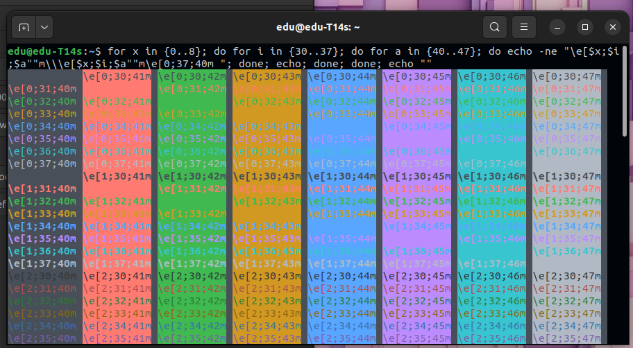
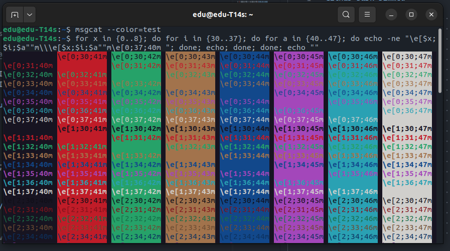
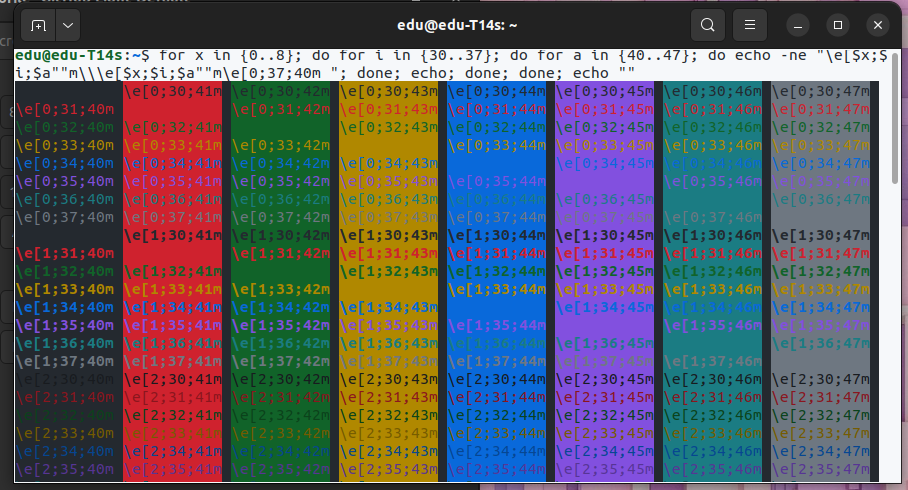

# Gnome-Terminal-GitHub-Theme

The VS Code GitHub Themes port for Gnome Terminal

## Available Themes

- GitHub Dark Dimmed :star2:
- GitHub Dark Default :star2:
- GitHub Light Default :star2:

## Preview

Here are some previews

### Dark Default



### Dark Dimmed



### Light Default



## Installation

For installation just execute desired command below. **Be careful, terminal may closed after install.**
This scripts creates a new profile for each version of the theme, I advice make a backup of your current profile to avoid losing it.
You need to have a profile to override.

### Dark Default install

```Bash
bash -c "$(curl -fsSL https://raw.githubusercontent.com/edurojasr/Gnome-Terminal-GitHub-Theme/main/github-dark-default.sh)"
```

### Dark Dimmed install

```Bash
bash -c "$(curl -fsSL https://raw.githubusercontent.com/edurojasr/Gnome-Terminal-GitHub-Theme/main/github-dark-dimmed.sh)"
```

### Light Default install

```Bash
bash -c "$(curl -fsSL https://raw.githubusercontent.com/edurojasr/Gnome-Terminal-GitHub-Theme/main/github-light-default.sh)"
```

### Not implemented

- GitHub Light (legacy) :x:
- GitHub Dark (legacy) :x:

## Credits

- Bash scripts base on: [denysdovhan](https://github.com/denysdovhan/one-gnome-terminal)
- Theme colors base on: [GitHub Theme](https://github.com/primer/github-vscode-theme)

Thanks you! :)
